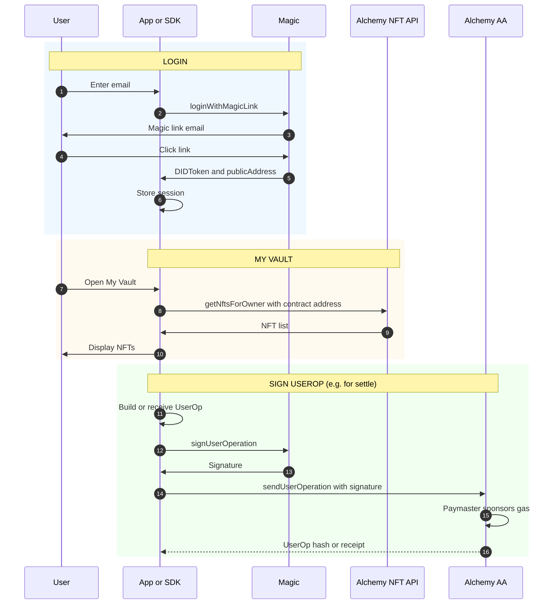
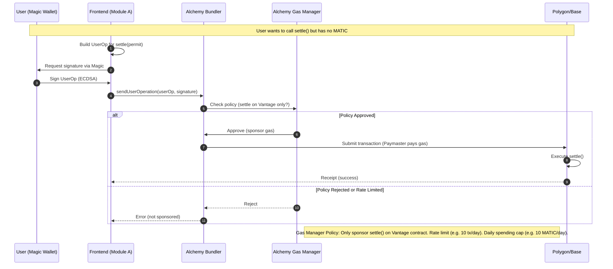

# Module A: Identity & Wallet

**"The Passenger"** — The user/identity holding the ticket and pushing the gate.

**Vantage Settlement Protocol — Build Independently, Combine Later**  
**Scope:** Auth, embedded wallet, gasless signing, NFT list and transfer history  
**Depends on:** Nothing (standalone)  

---

## Purpose

Module A delivers the **identity and wallet layer** for Vantage: passwordless login, embedded wallets, gasless transactions (Account Abstraction), and NFT indexing. It can be developed and tested without the settlement backend or smart contracts. When combined with Modules B and C, the full app uses A for login, "My Vault," and **executing the on-chain `settle()` call** (frontend claims the permit from B and executes the transaction).

---

## Sequence Flow

Standalone flow: login, My Vault (NFT list), and sign UserOp (for when combined with B).



---

## Tech Stack

| Component | Technology | Purpose |
|-----------|------------|---------|
| **Auth & Wallet** | Magic (magic.link) | Passwordless login, embedded wallets, signing |
| **Account Abstraction** | Alchemy AA (ERC-4337) | Gasless transactions, smart contract accounts |
| **NFT Indexing** | Alchemy NFT API | Query ownership, transfer history, holding period |

---

## Deliverables

1. **Identity SDK or API** (or frontend module) that:
   - Wraps Magic login and DID validation
   - Exposes `publicAddress` and (optionally) Smart Account address
   - Wraps Alchemy NFT API for "My Vault" (list NFTs by owner) and transfer history (for holding period)
   - Exposes "sign this UserOp" so the settlement service can request a signature and submit via Alchemy Bundler

2. **Minimal test app** (optional): Login → list NFTs → sign a test UserOp. Proves the stack without B or C.

---

## Interfaces (What A Exposes to Others)

### To Settlement (B)

- **Auth:** Backend receives `DIDToken` from frontend; validates via Magic and gets `publicAddress`.
- **NFT data:** B needs transfer history for a given token/owner to compute holding period for the royalty quote. Either:
  - B calls Alchemy NFT API directly with contract address and owner, or
  - A exposes an API/SDK method such as `getTransferHistory(ownerAddress, contractAddress)` that wraps Alchemy.

### To Chain (C) — "Ticket Booth" Model

- **Execution:** After reseller pays (B sets status to `paid`), the **frontend (A) calls `GET /permit` from B**, receives the permit and settle params, then **executes `settle()` on the contract (C)** via Alchemy AA (gasless).
- B does **not** execute settle; frontend does.

### To Frontend (Full App)

- Login (email magic link)
- Get current user `publicAddress` and metadata
- List NFTs for owner ("My Vault") for a given contract address
- Get transfer history for owner/token (for display or for quote)
- Sign UserOp when requested (e.g. for settlement)

---

## Implementation Notes

**Magic:**
```javascript
const magic = new Magic('pk_live_...');
const didToken = await magic.auth.loginWithMagicLink({ email });
const metadata = await magic.user.getMetadata(); // { publicAddress, email }
// Backend: magic.token.validate(didToken) → { publicAddress, email }
```

**Alchemy NFT API:**
```javascript
// NFTs by owner
const nfts = await alchemy.nft.getNftsForOwner(ownerAddress, {
  contractAddresses: [CONTRACT_ADDRESS]
});
// Transfer history (for holding period)
const transfers = await alchemy.nft.getTransfersForOwner(ownerAddress, {
  contractAddresses: [CONTRACT_ADDRESS]
});
```

**Alchemy AA:**  
Magic wallet is the signer/owner of the Smart Account. Frontend (A) builds the UserOp for `settle()`, uses Magic to sign, and submits via Alchemy Bundler with Gas Manager policy (e.g. sponsor only `settle()` on Vantage contract). Backend (B) does not submit transactions; it only generates permits.

**Account Abstraction Flow (How Gasless Transactions Work):**



**Gas Manager Security:** Configure Alchemy Gas Manager with strict policies to prevent abuse:
- **Function allowlist:** Only sponsor `settle()` calls on the Vantage contract
- **Rate limiting:** Max operations per address per day (e.g., 10 transfers/day/user)
- **Spending cap:** Daily budget limit to prevent gas tank draining
- **Monitoring:** Alert if spending spikes unexpectedly

Without these limits, malicious users could spam invalid `settle()` calls to drain your gas budget (even failed transactions can incur bundler overhead costs).

---

## Acceptance Criteria (Standalone)

- [ ] User can log in with email (Magic); backend can validate DIDToken and get address
- [ ] "My Vault" lists NFTs for a given owner and contract address (Alchemy NFT API)
- [ ] Transfer history for owner/token is available (for holding period or display)
- [ ] User can sign a UserOp (Magic); another service can submit it via Alchemy AA
- [ ] No dependency on Vantage contract deployment or settlement APIs; contract address can be configurable for testing

---

## When Combined With B and C

- Full app uses A for all auth, vault, and **executing settle()**
- After reseller pays via B, frontend (A) calls `GET /permit` from B, receives the permit, then uses Alchemy AA SDK (from A) to execute `settle()` on C (gasless)
- B uses Alchemy NFT API (same config as A) for NFT data (holding period for royalty quotes); B generates permits but does not submit transactions
