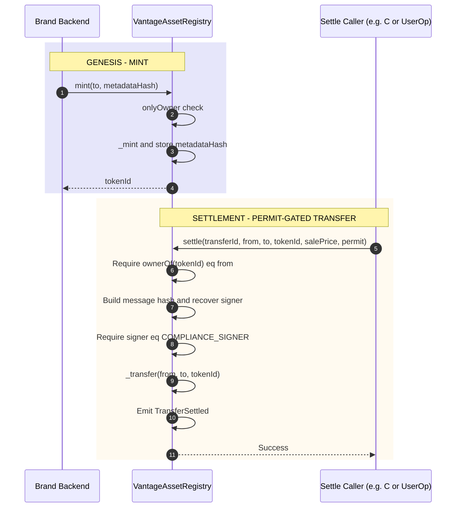

# Module B: Chain / Governance

**Vantage Settlement Protocol — Build Independently, Combine Later**  
**Scope:** Smart contracts, deployment, permit-gated transfers  
**Depends on:** Nothing (standalone)  
**Reference:** [vantage-technical-spec.md](../vantage-technical-spec.md)

---

## Purpose

Module B delivers the **on-chain governance layer**: the sovereign ERC-721 asset registry with permit-gated `settle()` so that transfers are only allowed after the backend has verified payment and signed a permit. No Stripe, Magic, or settlement backend required to develop and test B. When combined with C, the settlement service calls B's contract to execute transfers.

---

## Sequence Flow

Two flows: Genesis (mint) and Settlement (permit-gated transfer).



---

## Tech Stack

| Component | Technology | Purpose |
|-----------|------------|---------|
| **Smart contracts** | Solidity ^0.8.20, OpenZeppelin | ERC-721, ERC-2981, ECDSA, Ownable |
| **Framework** | Hardhat (or Foundry) | Build, test, deploy |
| **Chain** | Polygon or Base (EVM) | NFT registry, settlement execution |

---

## Deliverables

1. **VantageAssetRegistry (or equivalent)** contract:
   - ERC-721 + ERC-2981 (OpenZeppelin)
   - `mint(to, metadataHash)` — owner only
   - `transferFrom` / `safeTransferFrom` overridden to revert (direct transfers disabled)
   - `settle(transferId, from, to, tokenId, salePrice, permit)` — verifies backend signature then transfers

2. **Permit format (agreed with C):**
   - Message: `keccak256(abi.encodePacked(transferId, from, to, tokenId, salePrice))`
   - Sign with backend wallet; contract recovers signer and checks `signer == COMPLIANCE_SIGNER`

3. **Deploy scripts and verification** (e.g. Polygonscan)

4. **Tests:** Mint, blocked direct transfer, valid/invalid permit, settle flow

---

## Contract Interface (Exposed to Settlement)

**Settle function (must match backend permit generation):**
```solidity
function settle(
    uint256 transferId,
    address from,
    address to,
    uint256 tokenId,
    uint256 salePrice,
    bytes memory permit
) external;
```

**Permit verification (on-chain):**
- Message hash: `keccak256(abi.encodePacked(transferId, from, to, tokenId, salePrice))`
- EIP-191: `toEthSignedMessageHash(message)` then `recover(permit)`
- Require: `recoveredSigner == COMPLIANCE_SIGNER` and `ownerOf(tokenId) == from`

**Events:**  
`TransferSettled(transferId, tokenId, from, to, salePrice)` for analytics and indexing.

---

## Interfaces (What B Exposes to Others)

### To Settlement (C)

- **Contract address** and **ABI** (after deployment)
- **Permit payload:** Same as above so C's backend signer produces a signature the contract accepts
- No runtime dependency from B to C; B is an on-chain artifact C calls via RPC

### To Identity / Frontend (A)

- Contract address and (if needed) ABI for NFT listing and transfer history (Alchemy NFT API uses the address; A doesn't need to call the contract directly for normal flows)

---

## Implementation Notes

- Use OpenZeppelin: `ERC721`, `ERC2981`, `ECDSA`, `Ownable`
- Constructor: `complianceSigner` (backend public address) stored as immutable
- Default royalty (e.g. 5%) via `_setDefaultRoyalty`; transfer logic is permit-based, not payment-on-chain
- Optional: transfer lock (e.g. block settle if `block.timestamp - lastTransferTime < lockPeriod`) — implement if required by product

---

## Acceptance Criteria (Standalone)

- [ ] Contract deploys on testnet (Polygon Amoy or Base Sepolia)
- [ ] Mint (owner only) works; direct `transferFrom` reverts
- [ ] With a test permit (signed by compliance signer), `settle()` transfers NFT and emits `TransferSettled`
- [ ] Invalid or wrong-signer permit reverts
- [ ] ABI and permit format documented for C

---

## When Combined With C

- C configures contract address and ABI
- C generates permit with same payload; C (or frontend with Magic) submits `settle()` via Alchemy AA; gas sponsored by Gas Manager
