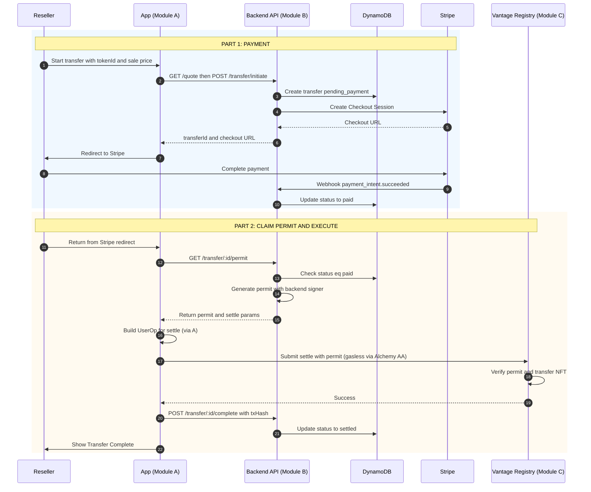
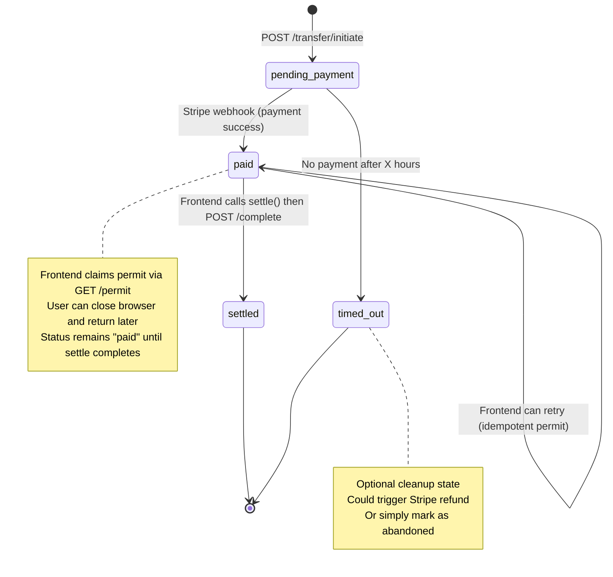

# Module B: Settlement Orchestration

**"The Ticket Booth"** — The Backend/Stripe. Verifies payment and issues the digital "ticket" (permit).

**Vantage Settlement Protocol — Build Independently, Combine Later**  
**Scope:** Quote API, Stripe payment, permit generation (stateless "Ticket Booth")  
**Depends on:** Module A (identity, NFT data), Module C (contract address, permit format)  
**Reference:** [vantage-technical-spec.md](../vantage-technical-spec.md)

---

## Purpose

Module B is the **permit generation layer** (the "Ticket Booth"): it computes the exit tax (royalty), collects payment from the reseller via Stripe, and issues the digital "ticket" (permit). The **frontend (Module A) executes the on-chain `settle()`**, not the backend. This keeps the backend stateless and simple. B depends on A for auth and NFT data (holding period); and on C for the contract address and permit format.

---

## Sequence Flow

**"Ticket Booth" model:** Backend verifies payment and issues permit; frontend executes settle.

---

## Tech Stack

| Component | Technology | Purpose |
|-----------|------------|---------|
| **Backend API** | Node.js/Lambda + API Gateway | Quote, initiate, permit generation, status |
| **State** | DynamoDB | Transfer records (pending_payment, paid, settled) |
| **Payment** | Stripe | Fiat payment for reseller exit tax (immediate capture) |
| **Permit signer** | Backend key (e.g. ethers Wallet) | ECDSA signature for contract (stateless) |

---

## Deliverables

1. **API endpoints:**
   - `GET /quote?tokenId=...&salePrice=...` — returns royalty amount (uses holding period from A or Alchemy NFT API)
   - `POST /transfer/initiate` — create transfer (`pending_payment`), create Stripe Checkout, return checkout URL and transferId
   - `GET /transfer/:id/permit` — (auth required) if status is `paid`, generate and return permit + settle params (transferId, from, to, tokenId, salePrice)
   - `GET /transfers?status=paid&resellerId={userId}` — (auth required) list incomplete transfers for user (for "stuck state" recovery when user returns after paying)
   - `POST /transfer/:id/complete` — (optional) frontend calls after settle succeeds; updates status to `settled` and stores txHash
   - `GET /transfer/:id/status` — return transfer status

2. **Stripe webhook** `POST /webhooks/stripe` (e.g. `payment_intent.succeeded`):
   - Load transfer by `paymentIntentId`
   - Set status `paid`
   - **That's it.** Backend does not execute settle; frontend will claim the permit and execute.

3. **DynamoDB:** Transfer table with at least: `transferId`, `status`, `paymentIntentId`, `resellerId`, `resellerAddress`, `tokenId`, `collectorAddress`, `declaredSalePrice`, `royaltyAmount`, `createdAt`, (optional) `txHash` if frontend reports it

---

## Interfaces (What B Consumes)

### From A (Identity & Wallet)

- **Auth:** Validate DIDToken; get reseller/collector `publicAddress`
- **NFT data:** Holding period for royalty — B calls Alchemy NFT API (or A's API) with owner and contract address to get last transfer date
- **Execution (frontend):** A (frontend) executes `settle()` with permit from B; backend doesn't need to sign or submit UserOps

### From C (Chain)

- **Contract address** and **ABI**
- **Permit format:** `keccak256(abi.encodePacked(transferId, from, to, tokenId, salePrice))` signed by backend; contract expects this and `COMPLIANCE_SIGNER`

---

## Flow Summary

1. Reseller initiates → B creates transfer (`pending_payment`) and Stripe session → returns checkout URL
2. Reseller pays → Stripe webhook → B sets `paid` (does not execute settle)
3. Reseller (frontend) calls `GET /permit` → B returns permit if status is `paid`
4. Frontend (A) builds UserOp and calls `settle()` via Alchemy AA (gasless) → Contract executes
5. (Optional) Frontend calls `POST /transfer/:id/complete` with txHash → C sets `settled`

**Recovery flow (if user closes browser after paying):**
1. User logs back in → Frontend (A) calls `GET /transfers?status=paid&resellerId={userId}`
2. If incomplete transfers exist → show "Complete Your Transfer" banner
3. User clicks → Frontend calls `GET /permit` and executes `settle()` (steps 3-5 above)

---

## Royalty Logic (Time-Based Tiers)

- Holding period from chain (Alchemy NFT API or A)
- &lt; 1 year: 10%; 1–3 years: 5%; &gt; 3 years: 2%
- `royaltyAmount = declaredSalePrice * tierRate`

---

## Transfer State Machine

Visualization of transfer lifecycle and state transitions in DynamoDB:

**Key insights:**
- `paid` is the "safe" state — user has paid, permit is claimable anytime
- Frontend is responsible for moving from `paid` → `settled` (execution)
- If user closes browser after paying, they can return and resume from `paid` state

---

## Acceptance Criteria

- [ ] Quote returns correct royalty for a given token and sale price (with mocked or real holding period)
- [ ] Initiate creates transfer and Stripe session; redirect to checkout
- [ ] On payment success webhook: status set to `paid`
- [ ] GET /permit returns permit if status is `paid`; 402 or error if `pending_payment`
- [ ] Permit is idempotent (same permit for same transfer, or deterministic generation)
- [ ] Auth check on GET /permit (only reseller can claim it)
- [ ] GET /transfers?status=paid returns incomplete transfers for authenticated user (stuck state recovery)
- [ ] POST /complete (optional) updates status to `settled` and stores txHash

---

## When Combined With A and C

- Frontend (A) uses Magic for login and "My Vault"; after reseller pays (B), frontend calls `GET /permit` from B, then uses A's Alchemy AA SDK to execute `settle()` (gasless)
- B's permit signer matches C's `COMPLIANCE_SIGNER` so the contract accepts the permit
- Full flow: Reseller pays exit tax via B → B sets `paid` → Frontend (A) claims permit from B → Frontend executes `settle()` on C (gas sponsored) → Collector receives NFT
