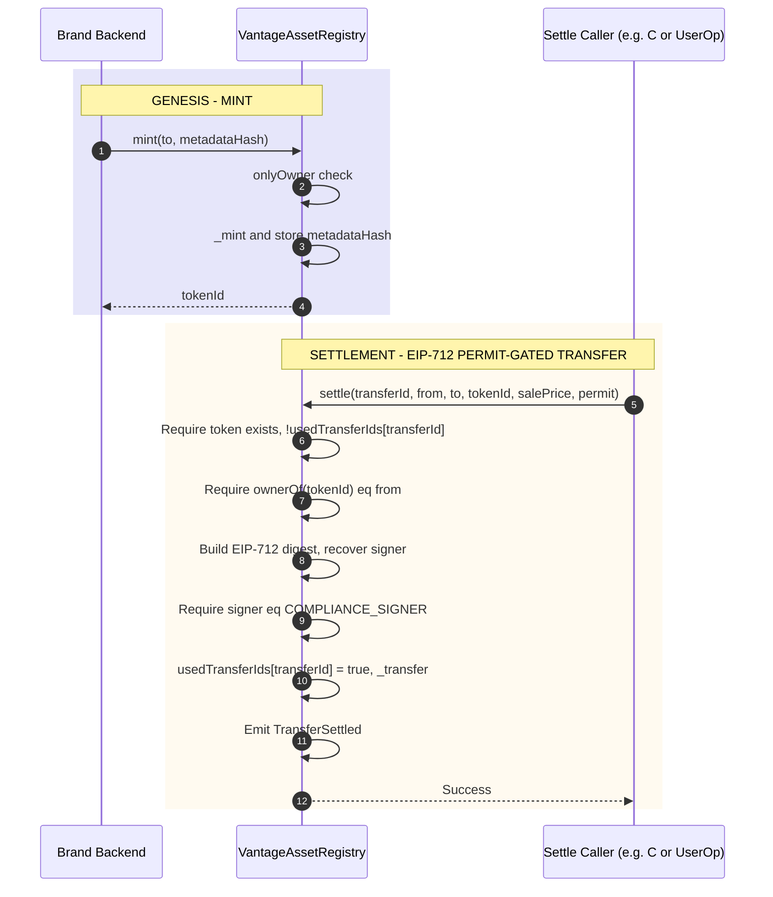

# Module C: Chain / Governance

**"The Turnstile"** — The Smart Contract. It remains locked until a cryptographic signature is presented.

**Vantage Settlement Protocol — Build Independently, Combine Later**  
**Scope:** Smart contracts, deployment, permit-gated transfers  
**Depends on:** Nothing (standalone)  

---

## Purpose

Module C delivers the **on-chain governance layer**: the sovereign ERC-721 asset registry with permit-gated `settle()` so that transfers are only allowed after the backend has verified payment and signed a permit. No Stripe, Magic, or settlement backend required to develop and test C. When combined with B, the settlement service calls C's contract to execute transfers.

---

## Sequence Flow

Two flows: Genesis (mint) and Settlement (permit-gated transfer).



---

## Tech Stack

| Component | Technology | Purpose |
|-----------|------------|---------|
| **Smart contracts** | Solidity ^0.8.20, OpenZeppelin | ERC-721, ECDSA, EIP712, Ownable, Pausable |
| **Framework** | Foundry | Build, test, deploy (forge, cast, anvil) |
| **Chain** | Polygon (Amoy testnet, Mainnet) | NFT registry, settlement execution |

---

## Deliverables

1. **VantageAssetRegistry** contract:
   - ERC-721 + EIP712 (OpenZeppelin: ERC721, Ownable, ECDSA, EIP712, **Pausable**)
   - **Kill switch (EU Data Act Art. 30):** Inherits `Pausable`. `pause()` / `unpause()` — `onlyOwner`. **Regulatory interruption:** `mint()` and `settle()` use `whenNotPaused`; when paused, mint and settle revert.
   - `mint(to, metadataHash)` — owner only, when not paused, stores on-chain metadata hash
   - `setBaseURI(baseURI)` / `baseURI()` — owner configures metadata endpoint for marketplaces
   - `tokenURI(tokenId)` — returns baseURI + tokenId (standard ERC721 for OpenSea compatibility); must remain publicly accessible so users can always view product data
   - `transferFrom` / `safeTransferFrom` overridden to revert (direct transfers disabled)
   - `settle(transferId, from, to, tokenId, salePrice, permit)` — when not paused, verifies EIP-712 signature then transfers (gas optimized: single `_ownerOf` call)
   - `DOMAIN_SEPARATOR()` — view for backend to build matching EIP-712 domain
   - Replay protection: `usedTransferIds` mapping; each `transferId` may be used once

2. **Permit format (EIP-712):**
   - Domain: `name: "VantageAssetRegistry"`, `version: "1"`, `chainId`, `verifyingContract`
   - Type: `Transfer(uint256 transferId, address from, address to, uint256 tokenId, uint256 salePrice)`
   - Backend signs typed data; contract builds same digest via `_hashTypedDataV4(structHash)` and recovers signer
   - Require: `recoveredSigner == COMPLIANCE_SIGNER` (and token exists, ownership, `!usedTransferIds[transferId]`)

3. **Deploy script and verification** (Foundry script, Polygonscan)

4. **Tests:** Mint, blocked direct transfer, valid/invalid EIP-712 permit, settle flow, replay and cross-contract replay

---

## Contract Interface (Exposed to Settlement)

**Minting and metadata:**
```solidity
function mint(address to, bytes32 metadataHash) external onlyOwner whenNotPaused returns (uint256);
function setBaseURI(string calldata baseURI) external onlyOwner;
function tokenURI(uint256 tokenId) external view returns (string memory);
```

**Settlement (must match backend EIP-712 signing):**
```solidity
function settle(
    uint256 transferId,
    address from,
    address to,
    uint256 tokenId,
    uint256 salePrice,
    bytes memory permit
) external whenNotPaused;
```

**Kill switch (governance):**
```solidity
function pause() external onlyOwner;
function unpause() external onlyOwner;
function paused() external view returns (bool);
```

**Views:**
```solidity
function DOMAIN_SEPARATOR() external view returns (bytes32);
function baseURI() external view returns (string memory);
```

**Permit verification (on-chain, EIP-712):**
- Struct hash: `keccak256(abi.encode(TRANSFER_TYPEHASH, transferId, from, to, tokenId, salePrice))`
- Digest: `_hashTypedDataV4(structHash)` (includes domain separator: chainId, contract address)
- Recover signer from `permit`; require `signer == COMPLIANCE_SIGNER`
- Require: token exists (`_ownerOf(tokenId) != 0`), `!usedTransferIds[transferId]`, `ownerOf(tokenId) == from`
- Then set `usedTransferIds[transferId] = true` and `_transfer(from, to, tokenId)`

**View:** `DOMAIN_SEPARATOR()` returns the EIP-712 domain separator for this contract (for backend signing).

**Events:**  
`TransferSettled(transferId, tokenId, from, to, salePrice)` for analytics and indexing.

---

## Interfaces (What C Exposes to Others)

### To Settlement (B)

- **Contract address** and **ABI** (after deployment)
- **EIP-712 permit:** Domain (name `"VantageAssetRegistry"`, version `"1"`, chainId, verifyingContract), type `Transfer(...)`, value fields matching `settle` args. B signs with `signTypedData`; same domain/type must be used so the contract’s digest matches.
- **DOMAIN_SEPARATOR():** B can call this view to verify or derive the correct domain.
- No runtime dependency from C to B; C is an on-chain artifact B calls via RPC.

### To Identity / Frontend (A)

- Contract address and (if needed) ABI for NFT listing and transfer history (Alchemy NFT API uses the address; A doesn't need to call the contract directly for normal flows)

---

## Implementation Notes

- Use OpenZeppelin: `ERC721`, `Ownable`, `ECDSA`, `EIP712`, **`Pausable`**
- Constructor: `complianceSigner` (backend public address) stored as immutable; EIP712 initialized with name `"VantageAssetRegistry"` and version `"1"`
- **Governance:** Only the authorized controller (owner) can trigger safe termination (EU Data Act Article 30) via `pause()` / `unpause()`
- Replay protection: `usedTransferIds[transferId]` set to `true` after each successful settle
- Custom errors: `DirectTransfersDisabled`, `InvalidPermitSigner`, `TransferIdAlreadyUsed`, `NotTokenOwner`, `TokenDoesNotExist`
- Settlement is permissionless: any caller can invoke `settle()` with a valid permit (e.g. user or relayer via Alchemy AA)
- **Marketplace compatibility:** `tokenURI()` returns `baseURI + tokenId` for OpenSea/Rarible; owner sets base via `setBaseURI()`
- **Gas optimization:** `settle()` uses single `_ownerOf()` call for both existence and ownership checks

---

## EU Data Act Article 30 (2026 MVP)

The contract is technically prepared for a 2026 MVP launch within the EU.

| Component | Status | Implementation |
|-----------|--------|----------------|
| **Governance** | ✅ Compliant | `onlyOwner` + `Pausable` (kill switch) |
| **Integrity** | ✅ Compliant | EIP-712 signed permits (backend verification) |
| **Privacy** | ✅ Compliant | On-chain `metadataHash` (link-breaking strategy) |
| **Marketplace** | ✅ Compliant | ERC-721 standard (`tokenURI`, `baseURI`) |

- **Mandatory kill switch:** `Pausable` provides `pause()` and `unpause()` (owner only).
- **Regulatory interruption:** `whenNotPaused` on `mint()` and `settle()` — no new mints or settlements while paused.
- **Governance control:** `onlyOwner` ensures only the designated legal entity can trigger safe termination.
- **Data Act safety:** Ensure `tokenURI` is publicly accessible so users can always view their product data.

**ESPR (Digital Product Passport):** For 2026 MVP, metadata served at `tokenURI` should use **JSON-LD** and include mandatory DPP fields (e.g. material origin, carbon footprint, repairability scores) as required by the regulation.

---

## Acceptance Criteria (Standalone)

- [ ] Contract deploys on testnet (Polygon Amoy) or mainnet (Polygon)
- [x] Mint (owner only) works; direct `transferFrom` / `safeTransferFrom` revert
- [x] With a valid EIP-712 permit (signed by compliance signer), `settle()` transfers NFT and emits `TransferSettled`
- [x] Invalid or wrong-signer permit reverts; replay (reused transferId) reverts
- [x] When paused, `mint()` and `settle()` revert; `pause()` / `unpause()` restricted to owner
- [x] ABI and EIP-712 permit format documented for B (see [implementation plan](module-c-implementation-plan.md))

---

## When Combined With B

- B configures contract address and ABI, and uses the same EIP-712 domain (name, version, chainId, verifyingContract) when signing.
- B generates EIP-712 permit (e.g. `signTypedData`) after verifying payment; frontend or user submits `settle()` via Alchemy AA; gas can be sponsored by Gas Manager.
