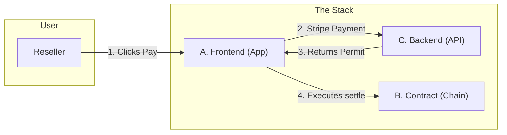

# Vantage Modules Overview

## What is Vantage?

Vantage is a **governance layer** for digital product passports (NFTs). When a reseller sells an asset, they pay an **exit tax** (royalty) via Stripe; only then can the NFT transfer to the new owner. The physical sale happens elsewhere (eBay, private sale, etc.); Vantage only governs the **digital twin** and enforces brand rules (royalties, transfer locks).

**Think of it like a subway:** the reseller (passenger) pays at the **Ticket Booth** (Stripe), receives a permit (ticket), and passes through the **Turnstile** (smart contract) to complete the transfer.

---

## Three Modules

The system is split into three parts you can build and test **separately**, then **combine**.

### [Module A — Identity & Wallet](./vantage-module-a-identity-wallet.md)

**"The Passenger"**

* **What it does:** The user/identity holding the ticket and pushing the gate. Logs users in, displays their Vault, and **executes the transfer**.
* **Key Responsibility:** Takes the permit from Module C and submits the transaction to Module B.
* **Tech:** Magic (Auth), Alchemy AA (Gasless Execution), React/Next.js.

### [Module B — Chain / Governance](./vantage-module-b-chain.md)

**"The Turnstile"**

* **What it does:** The Smart Contract. It remains locked until a cryptographic signature is presented. Blocks all standard transfers; only allows movement via `settle()` with a valid permit.
* **Key Responsibility:** Security and final settlement. It trusts no one except the cryptographic signature from Module C.
* **Tech:** Solidity, OpenZeppelin (ERC-721), Hardhat (Polygon).

### [Module C — Settlement Orchestration](./vantage-module-c-settlement.md)

**"The Ticket Booth"**

* **What it does:** The Backend/Stripe. Verifies payment and issues the digital "ticket" (permit). It is **stateless**—it does not execute blockchain transactions itself.
* **Key Responsibility:** Verifying payment and signing the permit.
* **Tech:** Next.js API Routes (for monorepo with A), or standalone Node.js/Lambda with Database.
* **Deployment Note:** In practice, Module C is typically implemented as API routes (`/api/`) in the same Next.js application as Module A. This eliminates repository fragmentation and allows the frontend and backend to share TypeScript types.

---

## How They Work Together

**The Critical Flow:**

1. **Reseller pays** via Module C (Stripe).
2. Module C marks the transfer as `PAID` and **generates a Permit** (signature).
3. Module A (Frontend) **claims the Permit** and submits the `settle()` transaction to Module B.
4. Module B verifies the signature and moves the NFT.
