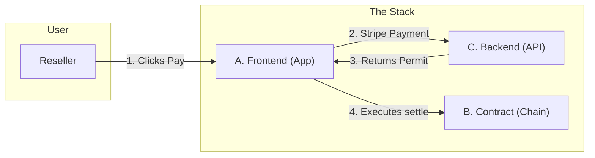

# Vantage Modules Overview

**Read this first.** This document explains the three modules that make up Vantage and how to navigate to their detailed specs.

---

## What is Vantage?

Vantage is a **governance layer** for digital product passports (NFTs). When a reseller sells an asset, they pay an **exit tax** (royalty) via Stripe; only then can the NFT transfer to the new owner. The physical sale happens elsewhere (eBay, private sale, etc.); Vantage only governs the **digital twin** and enforces brand rules (royalties, transfer locks).

---

## Three Modules

The system is split into three parts you can build and test **separately**, then **combine**.

### [Module A — Identity & Wallet](./vantage-module-a-identity-wallet.md)

**"The Client"**

* **What it does:** Logs users in, displays their Vault, and **executes the transfer**. It acts as the "steering wheel" for the user.
* **Key Responsibility:** Takes the permit from Module C and submits the transaction to Module B.
* **Tech:** Magic (Auth), Alchemy AA (Gasless Execution), React/Next.js.

### [Module B — Chain / Governance](./vantage-module-b-chain.md)

**"The Road"**

* **What it does:** The on-chain NFT contract. It blocks all standard transfers and only allows movement via the `settle()` function if a valid permit is provided.
* **Key Responsibility:** Security and final settlement. It trusts no one except the cryptographic signature from Module C.
* **Tech:** Solidity, OpenZeppelin (ERC-721), Hardhat (Polygon).

### [Module C — Settlement Orchestration](./vantage-module-c-settlement.md)

**"The Permit Vending Machine"**

* **What it does:** Calculates the royalty, accepts Fiat payment (Stripe), and issues a cryptographic **Permit**. It is **stateless**—it does not execute blockchain transactions itself.
* **Key Responsibility:** Verifying payment and signing the permit key.
* **Tech:** Next.js API Routes (or Node.js/Lambda), Database (Postgres/DynamoDB), Stripe API.
* **Note:** In practice, Module C is typically built as API routes within the same Next.js app as Module A (see Developer Roles below).

---

## How They Work Together

**The Critical Flow:**

1. **Reseller pays** via Module C (Stripe).
2. Module C marks the transfer as `PAID` and **generates a Permit** (signature).
3. Module A (Frontend) **claims the Permit** and submits the `settle()` transaction to Module B.
4. Module B verifies the signature and moves the NFT.

---

## Developer Roles & Build Order

For a modern web stack (like Next.js), **Dev 1 taking both A and C is the superior architecture.**

### Why Merging A + C Works Better

In modern development, the "Frontend" and "Backend API" often live in the same repository (e.g., a Next.js app where `app/` is the UI and `app/api/` is the Backend).

1. **Speed:** Dev 1 doesn't need to ask Dev 2 to change an API endpoint. If the UI needs extra data, Dev 1 just adds it to their own API route.
2. **Simplicity:** You eliminate an entire repository. Instead of `frontend-repo` and `backend-repo`, you just have `vantage-app` (A+C) and `vantage-contracts` (B).
3. **Type Safety:** If using TypeScript, Dev 1 can share the `Transfer` type definitions between the frontend and backend automatically.

---

### The New Role Split

#### 👨‍💻 Dev 1: The "Full Stack" App Lead

**Scope:** **Module A** (Identity/UI) + **Module C** (Stripe/Permits).  
**Repo:** `vantage-app` (Next.js)

* **The UI:** Login, Vault, "Sell" Form.
* **The API:** Receives the Stripe Webhook, updates the DB, and **signs the Permit**.
* **The Execution:** Takes the permit from their own API and submits it to the blockchain.

#### 👩‍💻 Dev 2: The Protocol Engineer

**Scope:** **Module B** (Chain).  
**Repo:** `vantage-contracts` (Hardhat/Foundry)

* **Solidity:** Writing the `VantageAssetRegistry.sol` contract.
* **Security:** This is high-stakes code. If Dev 2 has less "app" work, they can spend more time writing robust tests and security checks for the contract.
* **Tooling:** Writing scripts to verify contracts, manage upgrades, or seed test data.

---

### Revised "Handshake" (How They Collaborate)

Since Dev 1 is doing the heavy lifting on the app logic, **Dev 2's output becomes a dependency for Dev 1.**

1. **Dev 2 (Protocol):** Writes the contract and deploys it to Testnet.
2. **The Handoff:** Dev 2 gives Dev 1 two files:
   - `VantageRegistry.json` (The ABI)
   - `address.js` (The deployed address)
   - *(Bonus)* A generic "signing script" in JS that Dev 1 can paste into their backend to generate valid permits.

3. **Dev 1 (App):** Imports those files into the Next.js app and builds the rest.

---

### Security Considerations

Since Dev 1 is now handling the **Private Key** (for signing permits) in the backend, ensure they know basic security practices:

* **Rule:** Never commit `.env` files to Git.
* **Rule:** The Private Key used for signing must be stored in environment variables (e.g., `PERMIT_SIGNER_KEY`), never hardcoded.

---

## Implementation Timeline

**Week 1**

* **Dev 2:** Write Smart Contract, Test, Deploy to Polygon Amoy. **Deliver ABI & Address.**
* **Dev 1:** Setup Next.js. Build Login (Magic). Build "Sell" UI. Set up Stripe account.

**Week 2**

* **Dev 2:** Act as QA/Security Auditor. Write advanced integration tests. Maybe help Dev 1 with the specific `ethers.js` crypto signing logic if it gets tricky.
* **Dev 1:** Implement the API routes (`/api/initiate`, `/api/webhook`, `/api/permit`). Wire up the frontend to call these.

**Result:** This balance is more efficient, as Dev 1 avoids the friction of waiting for "the backend person" to fix endpoints.
