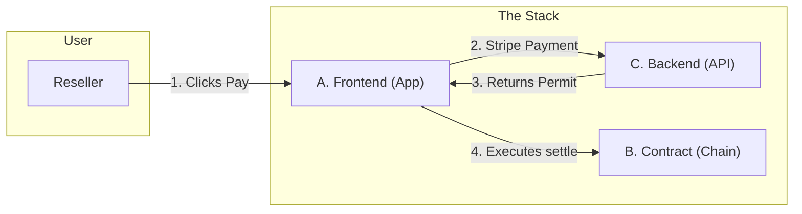

# Vantage Modules Overview

**Read this first.** This document explains the three modules that make up Vantage and how to navigate to their detailed specs.

---

## What is Vantage?

Vantage is a **governance layer** for digital product passports (NFTs). When a reseller sells an asset, they pay an **exit tax** (royalty) via Stripe; only then can the NFT transfer to the new owner. The physical sale happens elsewhere (eBay, private sale, etc.); Vantage only governs the **digital twin** and enforces brand rules (royalties, transfer locks).

---

## Three Modules

The system is split into three parts you can build and test **separately**, then **combine**.

### [Module A — Identity & Wallet](./vantage-module-a-identity-wallet.md)

**"The Client"**

* **What it does:** Logs users in, displays their Vault, and **executes the transfer**. It acts as the "steering wheel" for the user.
* **Key Responsibility:** Takes the permit from Module C and submits the transaction to Module B.
* **Tech:** Magic (Auth), Alchemy AA (Gasless Execution), React/Next.js.

### [Module B — Chain / Governance](./vantage-module-b-chain.md)

**"The Road"**

* **What it does:** The on-chain NFT contract. It blocks all standard transfers and only allows movement via the `settle()` function if a valid permit is provided.
* **Key Responsibility:** Security and final settlement. It trusts no one except the cryptographic signature from Module C.
* **Tech:** Solidity, OpenZeppelin (ERC-721), Hardhat (Polygon).

### [Module C — Settlement Orchestration](./vantage-module-c-settlement.md)

**"The Permit Vending Machine"**

* **What it does:** Calculates the royalty, accepts Fiat payment (Stripe), and issues a cryptographic **Permit**. It is **stateless**—it does not execute blockchain transactions itself.
* **Key Responsibility:** Verifying payment and signing the permit key.
* **Tech:** Next.js API Routes (for monorepo with A), or standalone Node.js/Lambda with Database.
* **Deployment Note:** In practice, Module C is typically implemented as API routes (`/api/`) in the same Next.js application as Module A. This eliminates repository fragmentation and allows the frontend and backend to share TypeScript types.

---

## How They Work Together

**The Critical Flow:**

1. **Reseller pays** via Module C (Stripe).
2. Module C marks the transfer as `PAID` and **generates a Permit** (signature).
3. Module A (Frontend) **claims the Permit** and submits the `settle()` transaction to Module B.
4. Module B verifies the signature and moves the NFT.

---

## Developer Roles & Build Order

For modern web development (Next.js/React), the recommended split is:

**Dev 1 owns Modules A + C** (application layer)  
**Dev 2 owns Module B** (protocol layer)

This architecture provides significant advantages over splitting A and C across developers:

- **Faster iteration:** Dev 1 controls both UI and API, eliminating cross-repository coordination overhead
- **Type safety:** Shared TypeScript definitions between frontend and backend in a monorepo
- **Single deployment:** One Next.js application instead of separate frontend and backend services

---

### Dev 1: Full-Stack Application Lead

**Responsibility:** Modules A + C  
**Repository:** `vantage-app` (Next.js monorepo)

**Deliverables:**
1. **Frontend (Module A):**
   - Magic authentication and session management
   - "My Vault" UI (Alchemy NFT API integration)
   - "Sell" flow UI with Stripe Checkout integration
   - Transaction execution via Alchemy AA (gasless)

2. **Backend API (Module C):**
   - API routes: `/api/quote`, `/api/transfer/initiate`, `/api/transfer/[id]/permit`
   - Stripe webhook handler (`/api/webhooks/stripe`)
   - Database operations (transfer records, status management)
   - **Permit signing** (cryptographic signature generation with backend private key)

**Key Skills:** React/Next.js, API design, Stripe integration, ethers.js (signing), database modeling

---

### Dev 2: Protocol Engineer

**Responsibility:** Module B  
**Repository:** `vantage-contracts` (Hardhat/Foundry)

**Deliverables:**
1. **Smart Contract:**
   - `VantageAssetRegistry.sol` (ERC-721 with permit-gated transfers)
   - Deployment scripts for testnet and mainnet
   - Contract verification (Polygonscan/Basescan)

2. **Developer Handoff Package:**
   - `VantageRegistry.json` (contract ABI)
   - `contract-address.ts` (deployed address by network)
   - Example permit signing code (JavaScript/TypeScript) for Dev 1 to integrate

3. **Testing & Security:**
   - Comprehensive unit tests (mint, settle, permit verification)
   - Integration tests simulating attack vectors
   - Gas optimization analysis

**Key Skills:** Solidity, smart contract security, Hardhat/Foundry, cryptography (ECDSA)

---

## Collaboration Flow

### 1. Initial Setup (Week 1)

**Dev 2 (Protocol):**
- Write and test `VantageAssetRegistry` contract
- Deploy to Polygon Amoy testnet
- **Deliver to Dev 1:** Contract ABI, deployed address, and permit signing example

**Dev 1 (Application):**
- Initialize Next.js project with TypeScript
- Implement Magic authentication
- Set up Stripe account and test mode
- Build "My Vault" UI shell

### 2. Integration (Week 2)

**Dev 1 (Application):**
- Import contract ABI and address from Dev 2
- Implement API routes (`/api/transfer/initiate`, `/api/webhooks/stripe`, `/api/transfer/[id]/permit`)
- Integrate permit signing logic (using example from Dev 2)
- Wire frontend to call own API routes
- Test full flow: initiate → Stripe payment → claim permit → execute settle

**Dev 2 (Protocol):**
- Support Dev 1 with permit signature troubleshooting
- Act as security reviewer (code review for private key handling)
- Write integration tests against deployed testnet contract
- Document any contract quirks or gas optimization tips for Dev 1

---

## Security Requirements

Since Dev 1 handles the **backend private key** (for signing permits), these security rules are critical:

### Environment Variable Management
- ✅ Store `PERMIT_SIGNER_PRIVATE_KEY` in `.env.local` (Next.js) or environment secrets (Vercel/Railway)
- ✅ Add `.env.local` to `.gitignore`
- ❌ **Never** commit `.env` files or hardcode private keys in source code

### Key Generation
- Use Dev 2's tooling or `ethers.Wallet.createRandom()` to generate a new key for testnet
- The public address of this key must match `COMPLIANCE_SIGNER` in the deployed contract

### Production Considerations
- For mainnet, consider using a **Hardware Security Module (HSM)** or **AWS KMS** instead of a raw private key
- Implement rate limiting on `/api/transfer/[id]/permit` to prevent permit farming

---

## Success Metrics

- **Week 1 Complete:** Dev 2 delivers working contract on testnet; Dev 1 has login + Vault working
- **Week 2 Complete:** Full end-to-end flow works: User pays → Permit generated → NFT transfers on-chain
- **Handoff Quality:** Dev 1 can sign valid permits without asking Dev 2 for help
