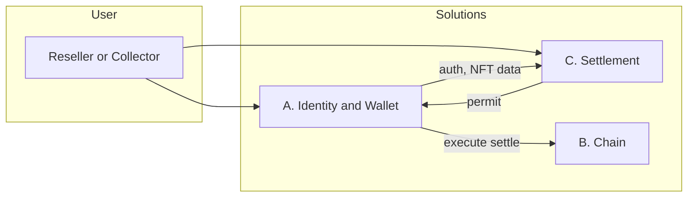

# Vantage Solutions Overview

**Read this first.** This document explains the three solutions that make up Vantage and how to navigate to their detailed specs.

---

## What is Vantage?

Vantage is a **governance layer** for digital product passports (NFTs). When a reseller sells an asset, they pay an **exit tax** (royalty) via Stripe; only then can the NFT transfer to the new owner. The physical sale happens elsewhere (eBay, private sale, etc.); Vantage only governs the **digital twin** and enforces brand rules (royalties, transfer locks).

---

## Three Solutions

The system is split into three parts you can build and test **separately**, then **combine**.

### Solution A — Identity & Wallet

**What it does:** Logs users in (passwordless), gives them an embedded wallet, lists their NFTs ("My Vault"), and lets them sign transactions. No payment or contract logic.

**Tech:** Magic (auth + wallet), Alchemy AA (gasless), Alchemy NFT API (NFT list + history).

**Depends on:** Nothing.

**→ Full brief:** [vantage-solution-a-identity-wallet.md](./vantage-solution-a-identity-wallet.md)

---

### Solution B — Chain / Governance

**What it does:** The on-chain NFT contract. Mints new passports and allows transfers only via `settle()` with a backend-signed **permit** (proving the exit tax was paid). Direct transfers are blocked.

**Tech:** Solidity, OpenZeppelin (ERC-721, ERC-2981), Hardhat. Deployed on Polygon or Base.

**Depends on:** Nothing.

**→ Full brief:** [vantage-solution-b-chain.md](./vantage-solution-b-chain.md)

---

### Solution C — Settlement Orchestration

**What it does:** Calculates the royalty (exit tax), collects payment from the reseller (Stripe), and generates the **permit** (the "Permit Vending Machine"). The **frontend (Solution A) executes the on-chain `settle()`** with the permit. Backend stays stateless.

**Tech:** Lambda, DynamoDB, Stripe. Uses A for auth and NFT data (holding period).

**Depends on:** A (auth, NFT data) and B (contract address, permit format).

**→ Full brief:** [vantage-solution-c-settlement.md](./vantage-solution-c-settlement.md)

---

## How They Work Together

- **A** and **B** are independent. Build either first (or in parallel).
- **C** needs A (for auth and holding period) and B (for contract address and permit format). Build C last to wire everything together.
- **Flow:** Reseller pays (C) → C generates permit → Frontend (A) claims permit from C → Frontend (A) executes `settle()` on B.

---

## Build Order

1. **B** (Chain) — Deploy contract, test mint and `settle()` with a test permit.
2. **A** (Identity & Wallet) — Login, My Vault, sign and execute UserOps. Can run in parallel with B.
3. **C** (Settlement) — Quote, Stripe, webhook, permit generation. Frontend (A) claims permit from C and executes `settle()` on B.

