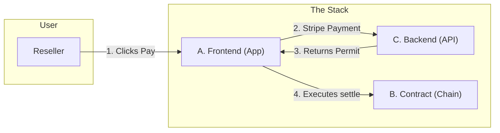

# Vantage Solutions Overview

**Read this first.** This document explains the three solutions that make up Vantage and how to navigate to their detailed specs.

---

## What is Vantage?

Vantage is a **governance layer** for digital product passports (NFTs). When a reseller sells an asset, they pay an **exit tax** (royalty) via Stripe; only then can the NFT transfer to the new owner. The physical sale happens elsewhere (eBay, private sale, etc.); Vantage only governs the **digital twin** and enforces brand rules (royalties, transfer locks).

---

## Three Solutions

The system is split into three parts you can build and test **separately**, then **combine**.

### [Solution A — Identity & Wallet](./vantage-solution-a-identity-wallet.md)

**"The Client"**

* **What it does:** Logs users in, displays their Vault, and **executes the transfer**. It acts as the "steering wheel" for the user.
* **Key Responsibility:** Takes the permit from Solution C and submits the transaction to Solution B.
* **Tech:** Magic (Auth), Alchemy AA (Gasless Execution), React/Next.js.

### [Solution B — Chain / Governance](./vantage-solution-b-chain.md)

**"The Road"**

* **What it does:** The on-chain NFT contract. It blocks all standard transfers and only allows movement via the `settle()` function if a valid permit is provided.
* **Key Responsibility:** Security and final settlement. It trusts no one except the cryptographic signature from Solution C.
* **Tech:** Solidity, OpenZeppelin (ERC-721), Hardhat (Polygon).

### [Solution C — Settlement Orchestration](./vantage-solution-c-settlement.md)

**"The Permit Vending Machine"**

* **What it does:** Calculates the royalty, accepts Fiat payment (Stripe), and issues a cryptographic **Permit**. It is **stateless**—it does not execute blockchain transactions itself.
* **Key Responsibility:** Verifying payment and signing the permit key.
* **Tech:** Node.js (Lambda), DynamoDB, Stripe API.

---

## How They Work Together

**The Critical Flow:**

1. **Reseller pays** via Solution C (Stripe).
2. Solution C marks the transfer as `PAID` and **generates a Permit** (signature).
3. Solution A (Frontend) **claims the Permit** and submits the `settle()` transaction to Solution B.
4. Solution B verifies the signature and moves the NFT.

---

## Developer Roles & Build Order

To move fast, we split development into two parallel tracks:

### Track 1: The Product Lead (Dev 1)

* **Owns:** **Solution A** (Frontend) + **Client-Side Integration**.
* **Tasks:**
1. Build Login & Vault UI.
2. Build the "Sell" form.
3. **Crucial:** Write the logic that calls `GET /permit` and sends the UserOp to Alchemy.

### Track 2: The Protocol Lead (Dev 2)

* **Owns:** **Solution B** (Chain) + **Solution C** (Backend).
* **Tasks:**
1. **First Priority:** Write & Deploy Solution B (Contract) to Testnet. (Dev 1 needs the Address & ABI).
2. Build the Stripe Integration.
3. Implement the "Permit Signing" logic (Crypto).

---

## Next Steps

1. **Dev 2** starts **Solution B**: Deploy the contract to Polygon Amoy.
2. **Dev 1** starts **Solution A**: Create the Next.js repo and integrate Magic.link.
3. **Converge**: Once the contract is deployed, Dev 1 connects the "My Vault" UI to the real contract address.
