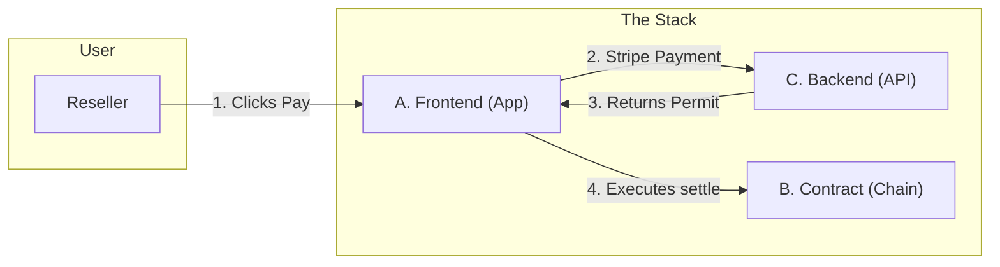
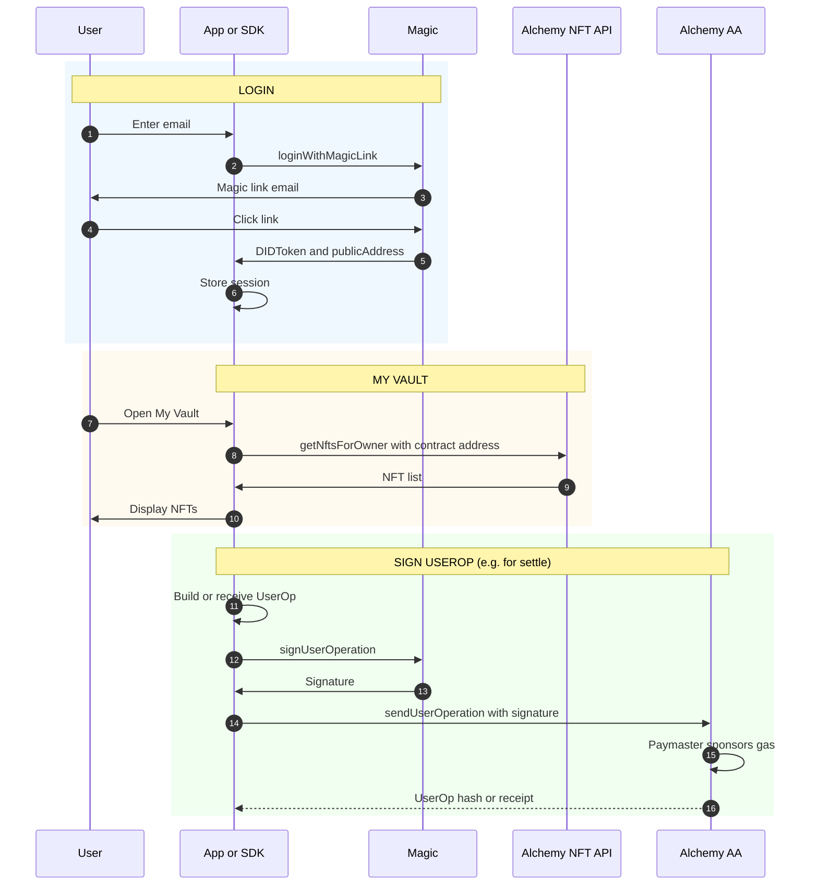
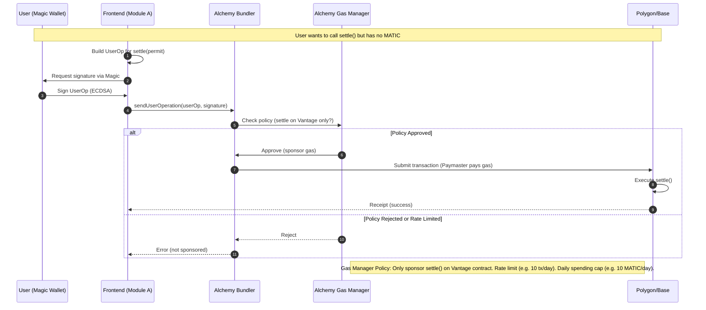
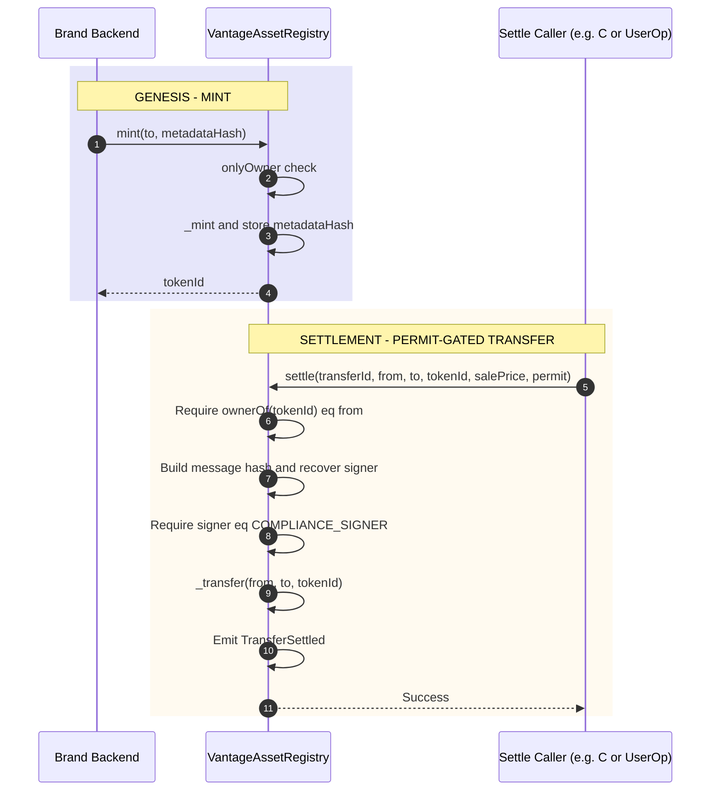
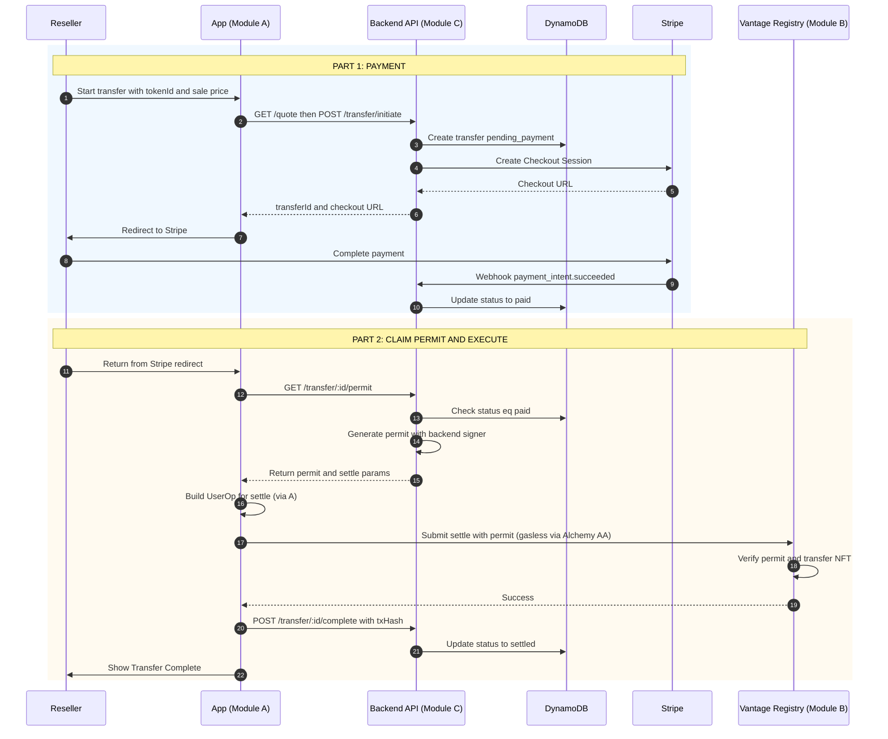
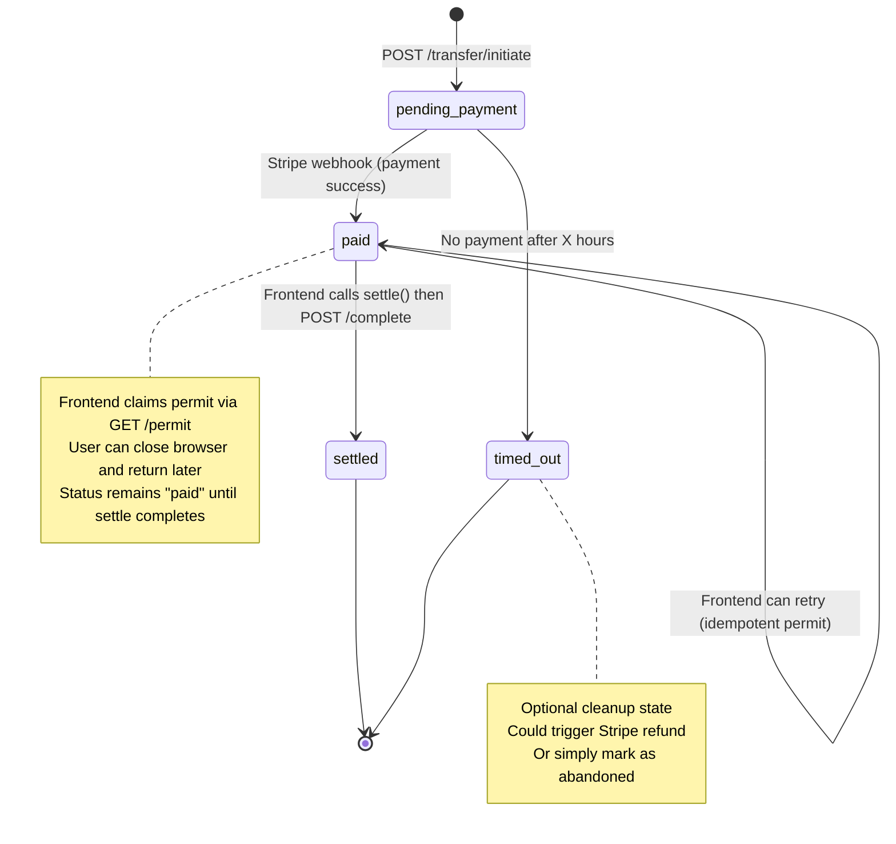

# Vantage Modules Overview

**Read this first.** This document explains the three modules that make up Vantage and how to navigate to their detailed specs.

---

## What is Vantage?

Vantage is a **governance layer** for digital product passports (NFTs). When a reseller sells an asset, they pay an **exit tax** (royalty) via Stripe; only then can the NFT transfer to the new owner. The physical sale happens elsewhere (eBay, private sale, etc.); Vantage only governs the **digital twin** and enforces brand rules (royalties, transfer locks).

---

## Three Modules

The system is split into three parts you can build and test **separately**, then **combine**.

### [Module A — Identity & Wallet](./vantage-module-a-identity-wallet.md)

**"The Client"**

* **What it does:** Logs users in, displays their Vault, and **executes the transfer**. It acts as the "steering wheel" for the user.
* **Key Responsibility:** Takes the permit from Module C and submits the transaction to Module B.
* **Tech:** Magic (Auth), Alchemy AA (Gasless Execution), React/Next.js.

### [Module B — Chain / Governance](./vantage-module-b-chain.md)

**"The Turnstile"**

* **What it does:** The on-chain NFT contract. It blocks all standard transfers and only allows movement via the `settle()` function if a valid permit is provided.
* **Key Responsibility:** Security and final settlement. It trusts no one except the cryptographic signature from Module C.
* **Tech:** Solidity, OpenZeppelin (ERC-721), Hardhat (Polygon).

### [Module C — Settlement Orchestration](./vantage-module-c-settlement.md)

**"The Permit Vending Machine"**

* **What it does:** Calculates the royalty, accepts Fiat payment (Stripe), and issues a cryptographic **Permit**. It is **stateless**—it does not execute blockchain transactions itself.
* **Key Responsibility:** Verifying payment and signing the permit key.
* **Tech:** Next.js API Routes (for monorepo with A), or standalone Node.js/Lambda with Database.
* **Deployment Note:** In practice, Module C is typically implemented as API routes (`/api/`) in the same Next.js application as Module A. This eliminates repository fragmentation and allows the frontend and backend to share TypeScript types.

---

## How They Work Together



**The Critical Flow:**

1. **Reseller pays** via Module C (Stripe).
2. Module C marks the transfer as `PAID` and **generates a Permit** (signature).
3. Module A (Frontend) **claims the Permit** and submits the `settle()` transaction to Module B.
4. Module B verifies the signature and moves the NFT.


---


# Module A: Identity & Wallet

**Vantage Settlement Protocol — Build Independently, Combine Later**  
**Scope:** Auth, embedded wallet, gasless signing, NFT list and transfer history  
**Depends on:** Nothing (standalone)  
**Reference:** [vantage-technical-spec.md](../vantage-technical-spec.md)

---

## Purpose

Module A delivers the **identity and wallet layer** for Vantage: passwordless login, embedded wallets, gasless transactions (Account Abstraction), and NFT indexing. It can be developed and tested without the settlement backend or smart contracts. When combined with Modules B and C, the full app uses A for login, "My Vault," and **executing the on-chain `settle()` call** (frontend claims the permit from C and executes the transaction).

---

## Sequence Flow

Standalone flow: login, My Vault (NFT list), and sign UserOp (for when combined with C).



---

## Tech Stack

| Component | Technology | Purpose |
|-----------|------------|---------|
| **Auth & Wallet** | Magic (magic.link) | Passwordless login, embedded wallets, signing |
| **Account Abstraction** | Alchemy AA (ERC-4337) | Gasless transactions, smart contract accounts |
| **NFT Indexing** | Alchemy NFT API | Query ownership, transfer history, holding period |

---

## Deliverables

1. **Identity SDK or API** (or frontend module) that:
   - Wraps Magic login and DID validation
   - Exposes `publicAddress` and (optionally) Smart Account address
   - Wraps Alchemy NFT API for "My Vault" (list NFTs by owner) and transfer history (for holding period)
   - Exposes "sign this UserOp" so the settlement service can request a signature and submit via Alchemy Bundler

2. **Minimal test app** (optional): Login → list NFTs → sign a test UserOp. Proves the stack without B or C.

---

## Interfaces (What A Exposes to Others)

### To Settlement (C)

- **Auth:** Backend receives `DIDToken` from frontend; validates via Magic and gets `publicAddress`.
- **NFT data:** C needs transfer history for a given token/owner to compute holding period for the royalty quote. Either:
  - C calls Alchemy NFT API directly with contract address and owner, or
  - A exposes an API/SDK method such as `getTransferHistory(ownerAddress, contractAddress)` that wraps Alchemy.

### To Chain (B) — "Permit Vending Machine" Model

- **Execution:** After reseller pays (C sets status to `paid`), the **frontend (A) calls `GET /permit` from C**, receives the permit and settle params, then **executes `settle()` on the contract (B)** via Alchemy AA (gasless).
- C does **not** execute settle; frontend does.

### To Frontend (Full App)

- Login (email magic link)
- Get current user `publicAddress` and metadata
- List NFTs for owner ("My Vault") for a given contract address
- Get transfer history for owner/token (for display or for quote)
- Sign UserOp when requested (e.g. for settlement)

---

## Implementation Notes

**Magic:**
```javascript
const magic = new Magic('pk_live_...');
const didToken = await magic.auth.loginWithMagicLink({ email });
const metadata = await magic.user.getMetadata(); // { publicAddress, email }
// Backend: magic.token.validate(didToken) → { publicAddress, email }
```

**Alchemy NFT API:**
```javascript
// NFTs by owner
const nfts = await alchemy.nft.getNftsForOwner(ownerAddress, {
  contractAddresses: [CONTRACT_ADDRESS]
});
// Transfer history (for holding period)
const transfers = await alchemy.nft.getTransfersForOwner(ownerAddress, {
  contractAddresses: [CONTRACT_ADDRESS]
});
```

**Alchemy AA:**  
Magic wallet is the signer/owner of the Smart Account. Frontend (A) builds the UserOp for `settle()`, uses Magic to sign, and submits via Alchemy Bundler with Gas Manager policy (e.g. sponsor only `settle()` on Vantage contract). Backend (C) does not submit transactions; it only generates permits.

**Account Abstraction Flow (How Gasless Transactions Work):**



**Gas Manager Security:** Configure Alchemy Gas Manager with strict policies to prevent abuse:
- **Function allowlist:** Only sponsor `settle()` calls on the Vantage contract
- **Rate limiting:** Max operations per address per day (e.g., 10 transfers/day/user)
- **Spending cap:** Daily budget limit to prevent gas tank draining
- **Monitoring:** Alert if spending spikes unexpectedly

Without these limits, malicious users could spam invalid `settle()` calls to drain your gas budget (even failed transactions can incur bundler overhead costs).

---

## Acceptance Criteria (Standalone)

- [ ] User can log in with email (Magic); backend can validate DIDToken and get address
- [ ] "My Vault" lists NFTs for a given owner and contract address (Alchemy NFT API)
- [ ] Transfer history for owner/token is available (for holding period or display)
- [ ] User can sign a UserOp (Magic); another service can submit it via Alchemy AA
- [ ] No dependency on Vantage contract deployment or settlement APIs; contract address can be configurable for testing

---

## When Combined With B and C

- Full app uses A for all auth, vault, and **executing settle()**
- After reseller pays via C, frontend (A) calls `GET /permit` from C, receives the permit, then uses Alchemy AA SDK (from A) to execute `settle()` on B (gasless)
- C uses Alchemy NFT API (same config as A) for NFT data (holding period for royalty quotes); C generates permits but does not submit transactions


---


# Module B: Chain / Governance

**Vantage Settlement Protocol — Build Independently, Combine Later**  
**Scope:** Smart contracts, deployment, permit-gated transfers  
**Depends on:** Nothing (standalone)  
**Reference:** [vantage-technical-spec.md](../vantage-technical-spec.md)

---

## Purpose

Module B delivers the **on-chain governance layer**: the sovereign ERC-721 asset registry with permit-gated `settle()` so that transfers are only allowed after the backend has verified payment and signed a permit. No Stripe, Magic, or settlement backend required to develop and test B. When combined with C, the settlement service calls B's contract to execute transfers.

---

## Sequence Flow

Two flows: Genesis (mint) and Settlement (permit-gated transfer).



---

## Tech Stack

| Component | Technology | Purpose |
|-----------|------------|---------|
| **Smart contracts** | Solidity ^0.8.20, OpenZeppelin | ERC-721, ERC-2981, ECDSA, Ownable |
| **Framework** | Hardhat (or Foundry) | Build, test, deploy |
| **Chain** | Polygon or Base (EVM) | NFT registry, settlement execution |

---

## Deliverables

1. **VantageAssetRegistry (or equivalent)** contract:
   - ERC-721 + ERC-2981 (OpenZeppelin)
   - `mint(to, metadataHash)` — owner only
   - `transferFrom` / `safeTransferFrom` overridden to revert (direct transfers disabled)
   - `settle(transferId, from, to, tokenId, salePrice, permit)` — verifies backend signature then transfers

2. **Permit format (agreed with C):**
   - Message: `keccak256(abi.encodePacked(transferId, from, to, tokenId, salePrice))`
   - Sign with backend wallet; contract recovers signer and checks `signer == COMPLIANCE_SIGNER`

3. **Deploy scripts and verification** (e.g. Polygonscan)

4. **Tests:** Mint, blocked direct transfer, valid/invalid permit, settle flow

---

## Contract Interface (Exposed to Settlement)

**Settle function (must match backend permit generation):**
```solidity
function settle(
    uint256 transferId,
    address from,
    address to,
    uint256 tokenId,
    uint256 salePrice,
    bytes memory permit
) external;
```

**Permit verification (on-chain):**
- Message hash: `keccak256(abi.encodePacked(transferId, from, to, tokenId, salePrice))`
- EIP-191: `toEthSignedMessageHash(message)` then `recover(permit)`
- Require: `recoveredSigner == COMPLIANCE_SIGNER` and `ownerOf(tokenId) == from`

**Events:**  
`TransferSettled(transferId, tokenId, from, to, salePrice)` for analytics and indexing.

---

## Interfaces (What B Exposes to Others)

### To Settlement (C)

- **Contract address** and **ABI** (after deployment)
- **Permit payload:** Same as above so C's backend signer produces a signature the contract accepts
- No runtime dependency from B to C; B is an on-chain artifact C calls via RPC

### To Identity / Frontend (A)

- Contract address and (if needed) ABI for NFT listing and transfer history (Alchemy NFT API uses the address; A doesn't need to call the contract directly for normal flows)

---

## Implementation Notes

- Use OpenZeppelin: `ERC721`, `ERC2981`, `ECDSA`, `Ownable`
- Constructor: `complianceSigner` (backend public address) stored as immutable
- Default royalty (e.g. 5%) via `_setDefaultRoyalty`; transfer logic is permit-based, not payment-on-chain
- Optional: transfer lock (e.g. block settle if `block.timestamp - lastTransferTime < lockPeriod`) — implement if required by product

---

## Acceptance Criteria (Standalone)

- [ ] Contract deploys on testnet (Polygon Amoy or Base Sepolia)
- [ ] Mint (owner only) works; direct `transferFrom` reverts
- [ ] With a test permit (signed by compliance signer), `settle()` transfers NFT and emits `TransferSettled`
- [ ] Invalid or wrong-signer permit reverts
- [ ] ABI and permit format documented for C

---

## When Combined With C

- C configures contract address and ABI
- C generates permit with same payload; C (or frontend with Magic) submits `settle()` via Alchemy AA; gas sponsored by Gas Manager


---


# Module C: Settlement Orchestration

**Vantage Settlement Protocol — Build Independently, Combine Later**  
**Scope:** Quote API, Stripe payment, permit generation (stateless "Permit Vending Machine")  
**Depends on:** Module A (identity, NFT data), Module B (contract address, permit format)  
**Reference:** [vantage-technical-spec.md](../vantage-technical-spec.md)

---

## Purpose

Module C is the **permit generation layer** (the "Permit Vending Machine"): it computes the exit tax (royalty), collects payment from the reseller via Stripe, and generates the cryptographic permit. The **frontend (Module A) executes the on-chain `settle()`**, not the backend. This keeps the backend stateless and simple. C depends on A for auth and NFT data (holding period); and on B for the contract address and permit format.

---

## Sequence Flow

**"Permit Vending Machine" model:** Backend verifies payment and generates permit; frontend executes settle.



---

## Tech Stack

| Component | Technology | Purpose |
|-----------|------------|---------|
| **Backend API** | Node.js/Lambda + API Gateway | Quote, initiate, permit generation, status |
| **State** | DynamoDB | Transfer records (pending_payment, paid, settled) |
| **Payment** | Stripe | Fiat payment for reseller exit tax (immediate capture) |
| **Permit signer** | Backend key (e.g. ethers Wallet) | ECDSA signature for contract (stateless) |

---

## Deliverables

1. **API endpoints:**
   - `GET /quote?tokenId=...&salePrice=...` — returns royalty amount (uses holding period from A or Alchemy NFT API)
   - `POST /transfer/initiate` — create transfer (`pending_payment`), create Stripe Checkout, return checkout URL and transferId
   - `GET /transfer/:id/permit` — (auth required) if status is `paid`, generate and return permit + settle params (transferId, from, to, tokenId, salePrice)
   - `GET /transfers?status=paid&resellerId={userId}` — (auth required) list incomplete transfers for user (for "stuck state" recovery when user returns after paying)
   - `POST /transfer/:id/complete` — (optional) frontend calls after settle succeeds; updates status to `settled` and stores txHash
   - `GET /transfer/:id/status` — return transfer status

2. **Stripe webhook** `POST /webhooks/stripe` (e.g. `payment_intent.succeeded`):
   - Load transfer by `paymentIntentId`
   - Set status `paid`
   - **That's it.** Backend does not execute settle; frontend will claim the permit and execute.

3. **DynamoDB:** Transfer table with at least: `transferId`, `status`, `paymentIntentId`, `resellerId`, `resellerAddress`, `tokenId`, `collectorAddress`, `declaredSalePrice`, `royaltyAmount`, `createdAt`, (optional) `txHash` if frontend reports it

---

## Interfaces (What C Consumes)

### From A (Identity & Wallet)

- **Auth:** Validate DIDToken; get reseller/collector `publicAddress`
- **NFT data:** Holding period for royalty — C calls Alchemy NFT API (or A's API) with owner and contract address to get last transfer date
- **Execution (frontend):** A (frontend) executes `settle()` with permit from C; backend doesn't need to sign or submit UserOps

### From B (Chain)

- **Contract address** and **ABI**
- **Permit format:** `keccak256(abi.encodePacked(transferId, from, to, tokenId, salePrice))` signed by backend; contract expects this and `COMPLIANCE_SIGNER`

---

## Flow Summary

1. Reseller initiates → C creates transfer (`pending_payment`) and Stripe session → returns checkout URL
2. Reseller pays → Stripe webhook → C sets `paid` (does not execute settle)
3. Reseller (frontend) calls `GET /permit` → C returns permit if status is `paid`
4. Frontend (A) builds UserOp and calls `settle()` via Alchemy AA (gasless) → Contract executes
5. (Optional) Frontend calls `POST /transfer/:id/complete` with txHash → C sets `settled`

**Recovery flow (if user closes browser after paying):**
1. User logs back in → Frontend (A) calls `GET /transfers?status=paid&resellerId={userId}`
2. If incomplete transfers exist → show "Complete Your Transfer" banner
3. User clicks → Frontend calls `GET /permit` and executes `settle()` (steps 3-5 above)

---

## Royalty Logic (Time-Based Tiers)

- Holding period from chain (Alchemy NFT API or A)
- &lt; 1 year: 10%; 1–3 years: 5%; &gt; 3 years: 2%
- `royaltyAmount = declaredSalePrice * tierRate`

---

## Transfer State Machine

Visualization of transfer lifecycle and state transitions in DynamoDB:



**Key insights:**
- `paid` is the "safe" state — user has paid, permit is claimable anytime
- Frontend is responsible for moving from `paid` → `settled` (execution)
- If user closes browser after paying, they can return and resume from `paid` state

---

## Acceptance Criteria

- [ ] Quote returns correct royalty for a given token and sale price (with mocked or real holding period)
- [ ] Initiate creates transfer and Stripe session; redirect to checkout
- [ ] On payment success webhook: status set to `paid`
- [ ] GET /permit returns permit if status is `paid`; 402 or error if `pending_payment`
- [ ] Permit is idempotent (same permit for same transfer, or deterministic generation)
- [ ] Auth check on GET /permit (only reseller can claim it)
- [ ] GET /transfers?status=paid returns incomplete transfers for authenticated user (stuck state recovery)
- [ ] POST /complete (optional) updates status to `settled` and stores txHash

---

## When Combined With A and B

- Frontend (A) uses Magic for login and "My Vault"; after reseller pays (C), frontend calls `GET /permit` from C, then uses A's Alchemy AA SDK to execute `settle()` (gasless)
- C's permit signer matches B's `COMPLIANCE_SIGNER` so the contract accepts the permit
- Full flow: Reseller pays exit tax via C → C sets `paid` → Frontend (A) claims permit from C → Frontend executes `settle()` on B (gas sponsored) → Collector receives NFT


---


